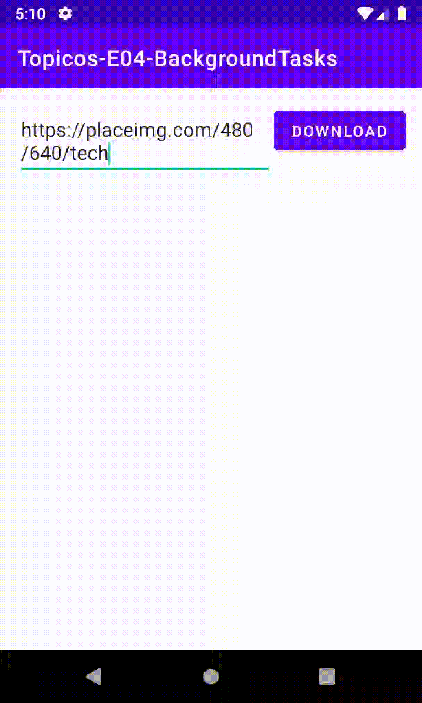

# Tópicos Android E04: Background Tasks

Professor: João Eduardo Montandon

## Visualizador de Imagens

Esse repositório contém a implementação parcial de um visualizador de imagens, onde as imagens são baixadas diretamente pelo aplicativo antes de serem exibidas.
Basicamente, o aplicativo deveria funcionar da seguinte forma: 
(a) o usuário fornece uma URL para a imagem no campo de texto, e então clica no botão de download; 
(b) o aplicativo faz o download da imagem e a renderiza na tela assim que o download tiver sido concluído.
(c) enquanto a imagem estiver sendo baixada, uma animação de loading deverá ser exibida na tela.

### 01 - Identificação do bug

No momento em que você executa o aplicativo, você vai observar que o app vai quebrar quando o link for fornecido e o botão de download for clicado.
Identifique o erro ocorrido (qual foi a exception lançada) e explique o motivo do erro.

**OBS: A resposta deverá ser fornecida no texto de entrega do pull request.**

### 02 - Download como tarefa de background

Atualize o aplicativo para que ele passe a suportar o download e carregamento das imagens por meio de tarefas de background.
Utilize os recursos que achar mais conveniente para implementação da tarefa.

### 03 - Exibição da barra de progresso

Você deve ter observado que essa versão do aplicativo não apresenta a barra de progresso durante o download da imagem.
Faça as alterações necessárias para exibir essa barra de progresso durante o processo de download, conforme instruções abaixo:

* Utilize o componente `ProgressBar` para mostrar que o arquivo está sendo baixado
* Esse componente deverá ser exibido centralizado e sobre os demais componentes da tela (veja o gif de exemplo)

*Dica: Forneça o componente diretamente na interface posicionando-o sobre os demais, e então alterne sua exibição por meio do método `setVisible()` logo antes de iniciar e após o término do download da imagem.* 
